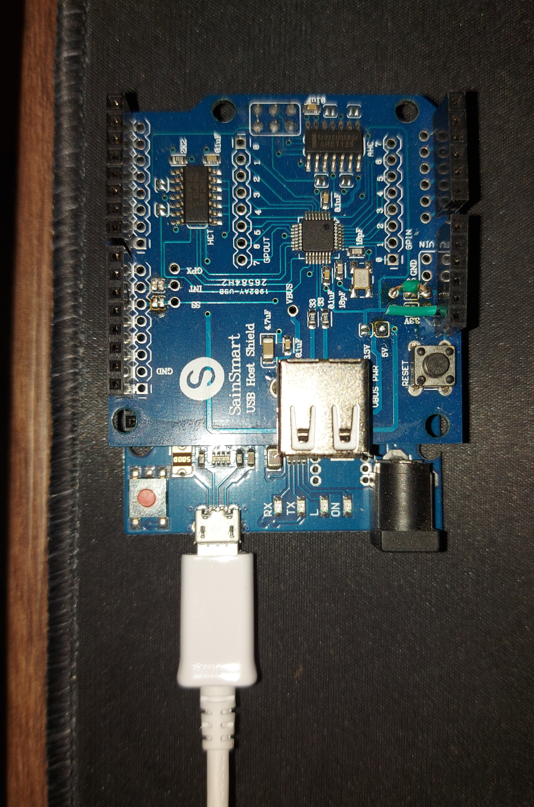

# Valorant Cheat
simple python color bot for valorant wich needs an arduino leonardo with a host-shield to run

Driver is in the Folder and should be uploaded with the newest version of arduino IDE.

Python must run on a 3.11 version ! 


## Arduino Leonardo + Hostshield Setup :

>

## Install all needed packages: 
````bash
- cd "your folder location"
- pip install requirements.txt
````
everything should work now, if not you can manually install the missing packeage with the following command:
```` python
pip install "name of the package"
````
 